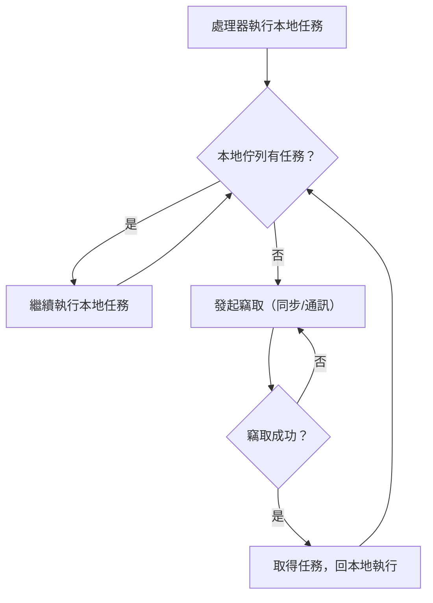

今天來分享一下關於Java和Golang在多線程處理上的見解。Java 21推出了一個新特性叫Virtual Thread，這個功能在使用語法上與傳統的thread pool相似，但在性能上有顯著提升。主要改進包括：

1. 架構優化：從之前的一對一線程映射，改進為一個carrier thread可以管理多個virtual thread
1. 管理層級轉移：線程管理權從操作系統轉移到JVM
1. 底層優化：包含特殊的調度算法和緩存機制

這個特性讓人聯想到Golang的goroutine，兩者確實在概念上非常相似。以下是一些主要的比較點：

1. 性能表現：當併發任務數量增加時，goroutine的性能表現優於virtual threads
1. 阻塞處理：
- Goroutine在遇到阻塞時會創建新的線程
- JVM則會暫停virtual thread並轉而處理其他任務
1. 開發體驗：
- Java virtual threads與現有thread pool的語法高度相似，開發者可以快速上手
- Golang的channel和go func語法相對抽象，需要額外學習時間

補充說明：根據效能測試，在處理大量併發任務時（如100萬個任務），Go的執行速度比Java Virtual Threads快約54%。不過，Java Virtual Threads在記憶體使用上更為節省，且與現有Java生態系統完全相容，這對於Java開發者來說是一個重要優勢。

經過 琴日研究左下 virtual thread 和 goroutine 發現入面都用到一樣 叫work stealing 嘅演算法 甘呢個演算個名甘搞笑 到底係做咩架呢？ 

甘我當然就問左我嘅好朋友 perplexity 啦 以下全部都係基於我理解嘅內容

如果有錯誤歡迎指教：

好 甘work-stealing 嘅principle 就主要係 每一個worker 都有自己嘅 task queue 

當某d worker 做完佢手頭上嘅task（task queue emtpy）佢就 會係其他worker 嘅queue入面 偷走一部分嘅task  

甘樣嘅做法就有兩個好處

1.減少一d syncchroize 同 thread-safe 操作 （即係一堆 read lock write lock）

2.自動load balance 左 d task 確保每個worker 都做緊野 唔會偷懶 （cpu100%！） 

透過呢個原理就造就左 java virtual thread 同 goroutine 強大嘅multithread 功能 

甘佢哋係implement 上嘅分別就係 

goroutine 有兩條queue 一條係p 嘅local queue 一條global 嘅task queue 

新task 本身預先會進入global queue 但worker 嘅local queue 清空做完曬，之後就會係global queue 到偷任務 ，如果global queue 都無任務 甘就隨機揀一個其他worker 偷佢一半嘅任務 

至於jvm vitural thread 嘅就無global task queue 每條carrier thread 都有local task queue empty 左就係其他carrier thread 到take ,應該就會係被人偷嘅queue 嘅相反方向take

本來我以為 fork join pool java 8 就有 甘係咪意味如果想係五升級java 嘅情況下 獲得性能上嘅提升 ，原來唔係 virtualthread 係 需要配合jvm 嘅升級先可以實現，不過有個冷知識 就係java8 嘅 stream api 背後原來都係用左forkjoinpool嘅lib 

