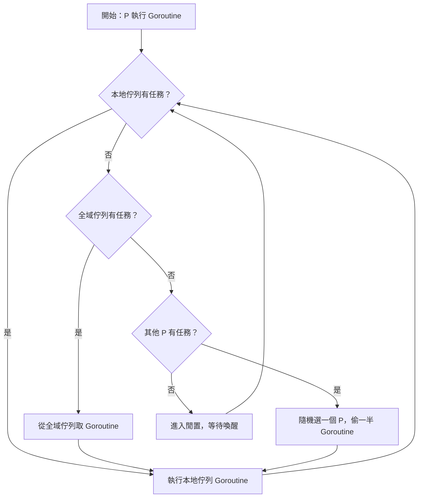
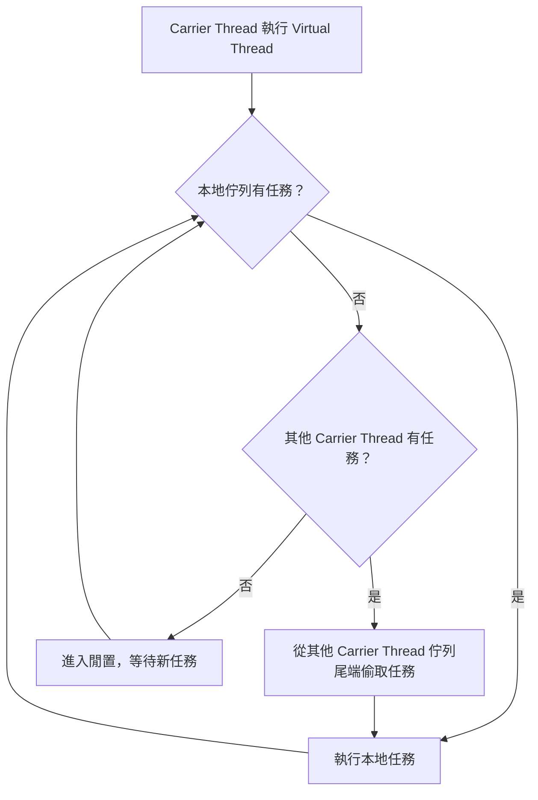

今天想與大家分享一下對於 Java 與 Golang 在多線程處理上的一些觀察與理解。Java 21 推出了一項新特性稱為 **Virtual Thread**，該功能在語法使用上與傳統的 thread pool 類似，但在效能方面有顯著提升。其主要改進包含以下幾點：

### Java Virtual Thread 改進重點：

1. **架構優化**：由以往的一對一線程映射模式，改為一條 carrier thread 可管理多條 virtual thread
1. **管理層級轉移**：線程的管理權從作業系統轉移至 JVM 層級
1. **底層優化**：包含特殊的排程演算法與快取（cache）機制，提升整體效能

此特性讓人不禁聯想到 Golang 的 goroutine，兩者在概念上確實非常相似。以下是兩者之間幾個主要比較點：

### Java Virtual Thread vs. Goloutine

- **效能表現**：當併發任務數量增加時，goroutine 的效能表現普遍優於 virtual thread
- **阻塞處理方式**：
	- goroutine 在遇到阻塞時會創建新的線程以保持流暢執行
	- JVM 則會暫停該 virtual thread，並轉而處理其他任務
- **開發體驗**：
	- Java Virtual Thread 的語法與既有 thread pool 高度相似，開發者能迅速上手
	- Golang 使用的 channel 與 `go func` 語法相對抽象，需花費額外時間學習與適應

📌 **補充：** 根據效能測試結果顯示，在處理大量併發任務時（例如一百萬個任務），Go 的執行速度約比 Java Virtual Threads 快 54%，不過也要視乎任務性質啦。

---

## Work Stealing 調度策略簡介

昨天深入研究 virtual thread 與 goroutine 的運作後，發現兩者皆使用了一種稱為 **Work Stealing** 的調度演算法。雖然名稱聽起來有些戲劇化，但其實原理非常實用與高效。以下內容為根據我自身理解整理而成，如有錯誤之處歡迎指正。

### Work Stealing 的核心原理

每一個 worker 擁有自己的任務佇列（task queue）。

當某一條 worker 完成了自己所有的任務（即 task queue 為空），它便會從其他 worker 的 queue 中「偷走」部分任務繼續執行。

**這種設計帶來兩項主要優勢：**

1. 減少對 synchronized 或 thread-safe 操作（例如 read lock、write lock 等）的依賴
1. 自動負載平衡，確保每一條 worker 都持續執行任務，不會有資源閒置，提高 CPU 使用率

---

## goroutine 與 Virtual Thread 在 Work Stealing 上的差異

### Golang 的實作策略

goroutine 在排程上會使用兩種 queue：

- 每個 P（Processor）擁有一個 local queue
- 系統本身設有一個 global task queue

執行邏輯如下：

- 新建立的任務預設會進入 global queue
- 當某個 worker 的 local queue 清空時，會先從 global queue 中取任務
- 如果 global queue 也為空，則會隨機選擇其他 worker，從其 queue 中偷取一半任務

📸 圖片：`goroutine` 的 task queue 概念

---

### JVM Virtual Thread 的實作策略

Java Virtual Thread 沒有設置 global task queue。每條 carrier thread 只擁有自己的 local task queue。

當其 queue 為空時，會從其他 carrier thread 的 queue 中取任務來執行，並且是從 queue 的相反方向進行任務竊取，提升快取命中率與併發效率。

📸 圖片：`virtual thread` 的 task queue 概念

---

## ForkJoinPool 能否替代 Virtual Thread？

一開始我以為 Java 8 就已有 ForkJoinPool 的實作，那是否意味著無需升級 Java 版本也能獲得類似 Virtual Thread 的效能提升呢？

實際上並非如此。**Virtual Thread 需配合 JVM 的升級才能實現**，單靠 ForkJoinPool 並無法完全取代。

不過，這裡有個冷知識：**Java 8 的 Stream API 背後其實就是使用 ForkJoinPool 來實作的。**

也就是說，早在 Java 8 時期，Work Stealing 的設計已經在標準庫中被應用了。

---

